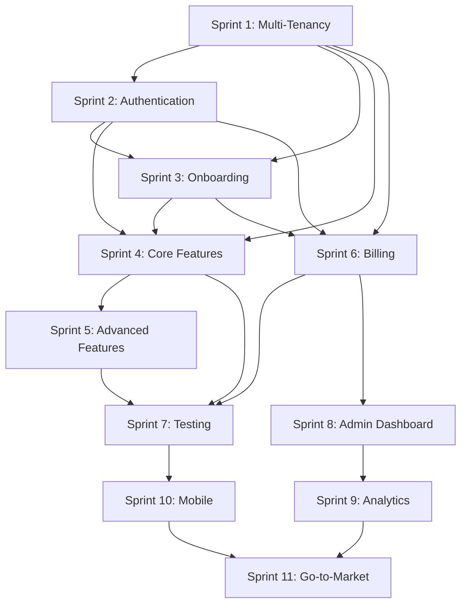

# Sprint Planning - Tennis Management System

## 📅 Resumen Ejecutivo

**Duración Total:** 22 semanas (5.5 meses)  
**Total Story Points:** 169  
**Total Issues:** 32  
**Sprints:** 11  

## 🎯 Objetivos por Sprint

### Sprint 1 - Multi-Tenancy Foundation (Semanas 1-2)
**Objetivo:** Implementar la base de multi-tenancy para permitir múltiples clubes  
**Story Points:** 16  
**Duración:** 2 semanas  

**Issues:**
- US-MT-001: Crear Modelo de Tenant (3 pts)
- US-MT-002: Implementar TenantService (5 pts)
- US-MT-003: Middleware de Extracción de Tenant (8 pts)

**Dependencias:** Ninguna  
**Entregables:** Sistema base multi-tenant funcional  

---

### Sprint 2 - Authentication & Authorization (Semanas 3-4)
**Objetivo:** Implementar login seguro y sistema de roles  
**Story Points:** 18  
**Duración:** 2 semanas  

**Issues:**
- US-AUTH-001: Implementar JWT Authentication (5 pts)
- US-AUTH-002: Sistema de Roles y Permisos (8 pts)
- US-AUTH-003: Password Reset Flow (5 pts)

**Dependencias:** Sprint 1  
**Entregables:** Sistema de autenticación completo  

---

### Sprint 3 - Onboarding & Signup (Semanas 5-6)
**Objetivo:** Crear experiencia de onboarding fluida para nuevos clubes  
**Story Points:** 16  
**Duración:** 2 semanas  

**Issues:**
- US-ONB-001: Wizard de Registro de Club (13 pts)
- US-ONB-002: Email de Bienvenida (3 pts)

**Dependencias:** Sprint 1, Sprint 2  
**Entregables:** Flujo de registro y onboarding completo  

---

### Sprint 4 - Core Features (Semanas 7-8)
**Objetivo:** Implementar funcionalidades básicas de gestión  
**Story Points:** TBD  
**Duración:** 2 semanas  

**Issues:** Por definir  
**Dependencias:** Sprint 1, Sprint 2, Sprint 3  
**Entregables:** Funcionalidades core del sistema  

---

### Sprint 5 - Advanced Features (Semanas 9-10)
**Objetivo:** Agregar funcionalidades avanzadas y optimizaciones  
**Story Points:** TBD  
**Duración:** 2 semanas  

**Issues:** Por definir  
**Dependencias:** Sprint 4  
**Entregables:** Funcionalidades avanzadas  

---

### Sprint 6 - Subscription & Billing (Semanas 11-12)
**Objetivo:** Implementar monetización con Stripe  
**Story Points:** 21  
**Duración:** 2 semanas  

**Issues:**
- US-BILL-001: Integración con Stripe (Setup) (5 pts)
- US-BILL-003: Checkout Flow - Upgrade a Pro (8 pts)
- US-BILL-004: Webhook - checkout.session.completed (8 pts)

**Dependencias:** Sprint 1, Sprint 2, Sprint 3  
**Entregables:** Sistema de billing funcional  

---

### Sprint 7 - Testing & Polish (Semanas 13-14)
**Objetivo:** Testing completo y pulimiento de funcionalidades  
**Story Points:** TBD  
**Duración:** 2 semanas  

**Issues:** Por definir  
**Dependencias:** Sprint 4, Sprint 5, Sprint 6  
**Entregables:** Sistema testeado y pulido  

---

### Sprint 8 - Admin Dashboard (Semanas 15-16)
**Objetivo:** Dashboard para super administradores  
**Story Points:** 8  
**Duración:** 2 semanas  

**Issues:**
- US-ADMIN-001: Dashboard de Super Admin (8 pts)

**Dependencias:** Sprint 6  
**Entregables:** Dashboard administrativo funcional  

---

### Sprint 9 - Analytics & Reporting (Semanas 17-18)
**Objetivo:** Sistema completo de analytics y reportes  
**Story Points:** 8  
**Duración:** 2 semanas  

**Issues:**
- US-ANALYTICS-001: Dashboard de Métricas (8 pts)

**Dependencias:** Sprint 8  
**Entregables:** Sistema de analytics funcional  

---

### Sprint 10 - Mobile Features (Semanas 19-20)
**Objetivo:** Optimizaciones y funcionalidades específicas para móvil  
**Story Points:** 5  
**Duración:** 2 semanas  

**Issues:**
- US-MOBILE-001: Notificaciones Push (5 pts)

**Dependencias:** Sprint 7  
**Entregables:** Funcionalidades móviles optimizadas  

---

### Sprint 11 - Go-to-Market (Semanas 21-22)
**Objetivo:** Preparar todo para el lanzamiento público  
**Story Points:** 21  
**Duración:** 2 semanas  

**Issues:**
- US-GTM-001: Landing Page (8 pts)
- US-GTM-002: Help Center (13 pts)

**Dependencias:** Sprint 9, Sprint 10  
**Entregables:** Sistema listo para lanzamiento  

---

## 🗺️ Roadmap Visual

```
Sprint 1  [MT]     ████████████████████ 2 semanas
Sprint 2  [AUTH]   ████████████████████ 2 semanas
Sprint 3  [ONB]    ████████████████████ 2 semanas
Sprint 4  [CORE]   ████████████████████ 2 semanas
Sprint 5  [ADV]    ████████████████████ 2 semanas
Sprint 6  [BILL]   ████████████████████ 2 semanas
Sprint 7  [TEST]   ████████████████████ 2 semanas
Sprint 8  [ADMIN]  ████████████████████ 2 semanas
Sprint 9  [ANAL]   ████████████████████ 2 semanas
Sprint 10 [MOBILE] ████████████████████ 2 semanas
Sprint 11 [GTM]    ████████████████████ 2 semanas
```

## 📊 Métricas por Sprint

| Sprint | Issues | Points | Duración | Dependencias |
|--------|--------|--------|----------|--------------|
| 1      | 3      | 16     | 2 sem    | Ninguna      |
| 2      | 3      | 18     | 2 sem    | Sprint 1     |
| 3      | 2      | 16     | 2 sem    | Sprint 1,2   |
| 4      | TBD    | TBD    | 2 sem    | Sprint 1,2,3 |
| 5      | TBD    | TBD    | 2 sem    | Sprint 4     |
| 6      | 3      | 21     | 2 sem    | Sprint 1,2,3 |
| 7      | TBD    | TBD    | 2 sem    | Sprint 4,5,6 |
| 8      | 1      | 8      | 2 sem    | Sprint 6     |
| 9      | 1      | 8      | 2 sem    | Sprint 8     |
| 10     | 1      | 5      | 2 sem    | Sprint 7     |
| 11     | 2      | 21     | 2 sem    | Sprint 9,10  |

## 🎯 Milestones

### Milestone 1: MVP Core (Fin Sprint 3)
- ✅ Multi-tenancy funcional
- ✅ Autenticación completa
- ✅ Onboarding funcional
- **Fecha:** Semana 6

### Milestone 2: Feature Complete (Fin Sprint 6)
- ✅ Funcionalidades core
- ✅ Billing funcional
- ✅ Testing básico
- **Fecha:** Semana 12

### Milestone 3: Production Ready (Fin Sprint 9)
- ✅ Admin dashboard
- ✅ Analytics completo
- ✅ Testing completo
- **Fecha:** Semana 18

### Milestone 4: Launch Ready (Fin Sprint 11)
- ✅ Mobile optimizado
- ✅ Go-to-market completo
- ✅ Sistema listo para producción
- **Fecha:** Semana 22

## 🔄 Dependencias Críticas



## 📋 Checklist de Sprint

### Antes de cada Sprint:
- [ ] Revisar dependencias
- [ ] Confirmar capacidad del equipo
- [ ] Actualizar estimaciones si es necesario
- [ ] Configurar milestone en Linear

### Durante cada Sprint:
- [ ] Daily standups
- [ ] Seguimiento de progreso
- [ ] Resolución de blockers
- [ ] Testing continuo

### Al final de cada Sprint:
- [ ] Sprint review
- [ ] Sprint retrospective
- [ ] Actualizar métricas
- [ ] Planificar siguiente sprint

## 🚀 Próximos Pasos

1. **Configurar milestones en Linear** para cada sprint
2. **Asignar fechas específicas** a cada sprint
3. **Configurar labels** para tracking (sprint-1, sprint-2, etc.)
4. **Iniciar Sprint 1** con Multi-Tenancy Foundation
5. **Configurar CI/CD** para testing automático
6. **Establecer métricas** de seguimiento

---

**Última actualización:** Octubre 2025  
**Próxima revisión:** Después de Sprint 1
